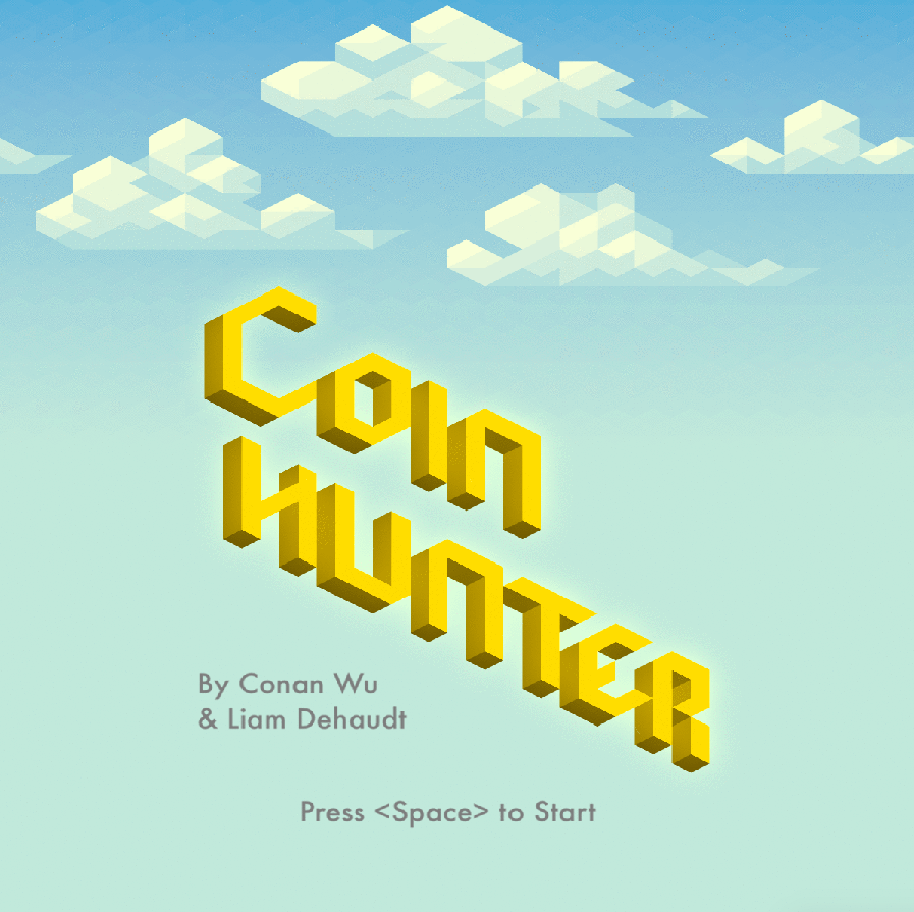
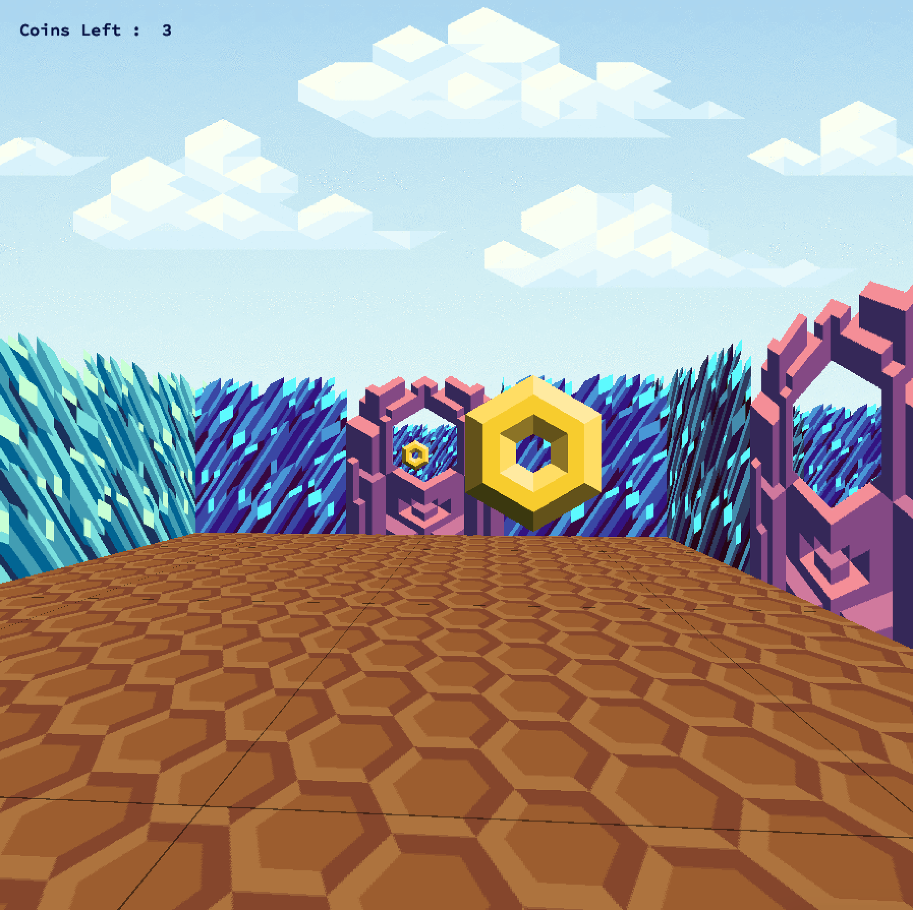

# 42_wolf3D
A small engine to run maps in the style of wolf3d. Includes coin hunter, a quick game made using that engine.
 This project was made in collaboration with Conan Wu.
 
 ## starting the program
 
 'make' will compile two executables, wolf3d and coin_hunter. You can run wolf3d by passing a map found in maps.
 Coinhunter runs without parameters and will start the game.
 
 ## input
 
 Arrow keys to move.
 
 ## Screenshots
 

 
 
